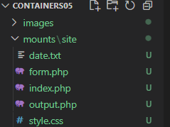
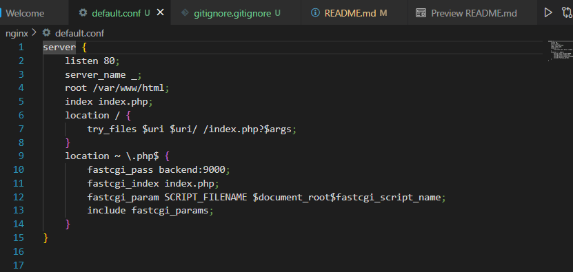
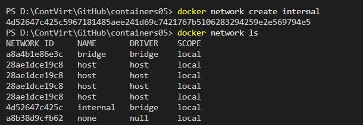
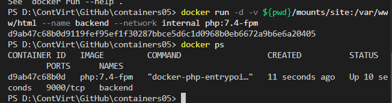
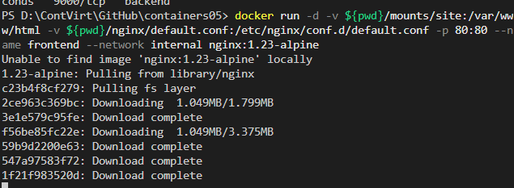
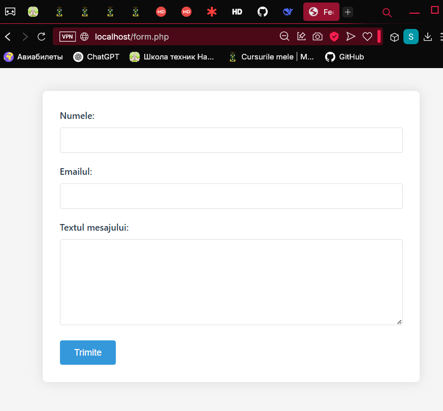

# Lucrarea de laborator numarul 6
### <i>Tema:</i> Rularea site-ului într-un container
### <i>Data:</i>23.03.2025 

## I. Scopul lucrării
După finalizarea acestei lucrări studentul va fi capabil să gestioneze interacțiunea între mai multe containere.

## II. Sarcina
Creați o aplicație PHP pe baza a două containere: nginx, php-fpm.

## Efectuarea lucrării
Am creat pentru inceput reposzitoriul `containers05` pe GitHub si l-am clonat pe computer. 

In directorul `containers05` am creat directorul `mounts/site` si am copiat in el un site `php`.



Am creat in continuare fiserul `.gitignore` in care am adaugat liniile:
```sh
# Ignore files and directories
mounts/site/*
```

In continuare creez fisierul `nginx/default.conf` cu următorul conținut necesar:


## Pornirea și testarea
Creez reteaua `internal pentru containere`:


Creez containerul `backend` cu următoarele proprietăți:
+ pe baza imaginii `php:7.4-fpm`;
+ directorul `mounts/site` este montat în `/var/www/html`;
+ funcționează în rețeaua `internal`.



Creez containerul `frontend` cu următoarele proprietăți:
+ pe baza imaginii `nginx:1.23-alpine`;
+ directorul `mounts/site` este montat în `/var/www/html`;
+ fișierul `nginx/default.conf` este montat în `/etc/nginx/conf.d/default.conf`;
+ portul `80` al containerului este expus pe portul `80` al calculatorului gazdei;
+ funcționează în rețeaua `internal`.


Pornesc testarea prin adresa `http://localhost/form.php` pentru a testa daca lucreaza site-ul.


## Răspunsuri la întrebări
1. În ce mod în acest exemplu containerele pot interacționa unul cu celălalt?
+ Containerele comunică prin rețeaua Docker internal.
2. Cum văd containerele unul pe celălalt în cadrul rețelei internal?
+ Fiecare container din rețeaua internal poate accesa celălalt prin numele său (backend sau frontend).
3. De ce a fost necesar să se suprascrie configurarea nginx?
+ Configurația implicită a Nginx nu știe să routeze cererile PHP către un container separat.

## Concluzie
In ura efecturaii acestei lucrari de laborator am invata cum se creaza si se realizeaza comunicarea intre containere prin `docker network <NAME>`. Am aflat cum se pot monta directoarele intre ele si cum se produce aceatsa montare a volumelor.